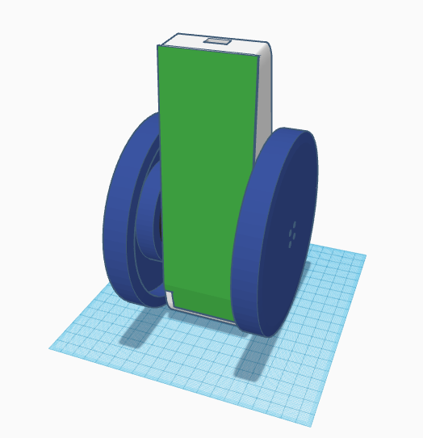
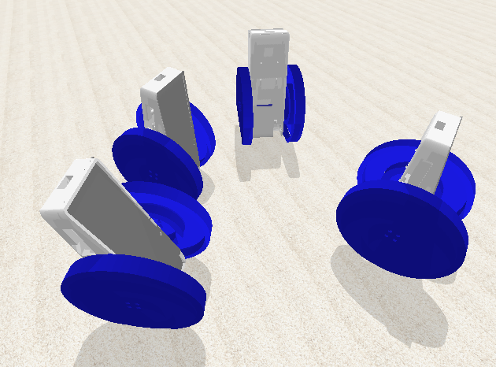

# **Betabot**

### A robot for deep learning.

**Includes:** 3D printable model, hardware parts list, build instructions, easy to use simulator, and downloadable pre-built software images.

*All open source.*

**Consists of:** Raspberry Pi 3, TensorFlow, PID and differential drive controller, drone flight controller for IMU & PWM, gimbal motors, LiPo battery, power management boards, magnetic rotational sensors, and a tail.

**Pre-built hardware:** AU$299.

The 3D model:

And inside, with just the battery. You can see where the Pi goes, at the top, with the 3cm x 3cm flight controller board behind it.

The physics simulator. The robots are having a conference:

Or a dance party.

