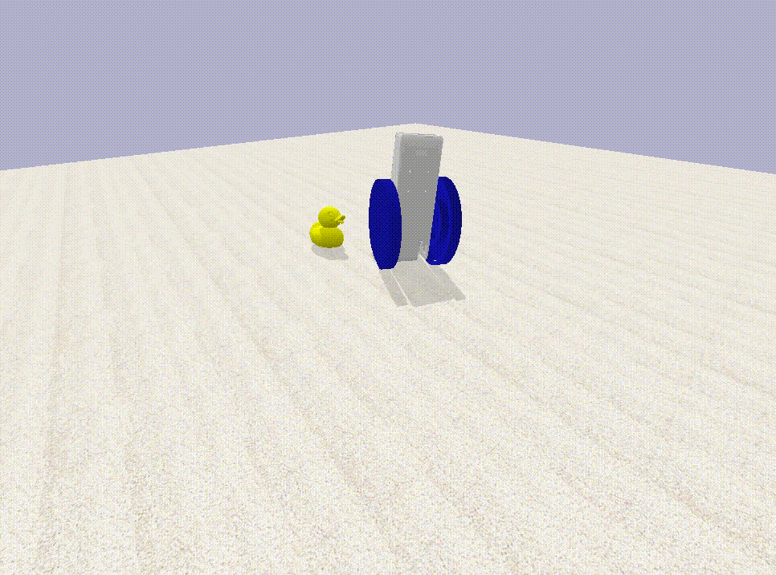

# **Betabot**

### A robot for deep learning.

**Includes:** 3D printable model, hardware parts list, build instructions, easy to use simulator, and downloadable pre-built software images.

*All open source.*

**Consists of:** Raspberry Pi 3, TensorFlow, PID and differential drive controller, drone flight controller for IMU & PWM, gimbal motors, LiPo battery, power management boards, magnetic rotational sensors, and a tail.

**Pre-built hardware:** AU$399.

The 3D model:

And inside, with just the battery. You can see where the Pi goes, at the top, with the 3cm x 3cm flight controller board behind it.

The physics simulator. The robots are having a conference:

Or a dance party.

And ducking about.

[See it in action here](https://twitter.com/TomPJacobs/status/848138218755170305).

## How to build

Take the 3D printed case, two motors, and 6 screws. Make sure the small magnets are still affixed to back of motor axels. Place one motor on the side with cables running through the hole in the case. Rotate until screw holes line up, and screw 3 screws in half way.

Take one motor sensor (small green AMS board with one chip), and slide it into position under the three screws, with chip facing towards and sitting directly under the motor axel magnet. Screw 3 screws fully in to hold the motor and board in place. Repeat with the other motor. Use the L screwdriver to reach the screws. A little tricky, but a lot easier with the L screwdriver.

Take the 3cm x 3cm RacerX controller board and place it into the mounting square in the case, with the microUSB port facing out towards the open side. Screw it down with four tiny screws.

Take the Raspberry Pi board and place it over the smaller board, with USB ports facing towards the middle of the case and the HDMI port facing out towards the open side. Screw down with three small screws. Place the on switch into position on the left side hole, facing out.

Take the two speed controller boards and plug the motors into them, either way around, either speed controller. Place them down in the small middle area of the case, with red and black power leads facing right, away from the open side. Snake the cables up on the right side.

Place the two power boards on top of the speed controller boards, and tuck them under the case mounts. 

Run the power cable into the battery compartment. Squeeze the battery into the battery compartment and plug it in. There may be a small pop but not much more.

Take the battery charger board and slide it in over the top of the battery with the white ports facing inwards. Plug the battery's charge cable into the largest white port. Screw into place with one screw. Screw two round headed screws through the bottom of the case into the charge bolts.

Take the top 3D printed cover and place it over the top of the case. Align the screw holes and screw the long screws in to affix the top. It should open freely 90 degrees and close completely.

Plug the power adapter into the bottom of the robot and press the on button. The robot should wake up after a minute and come to life.

