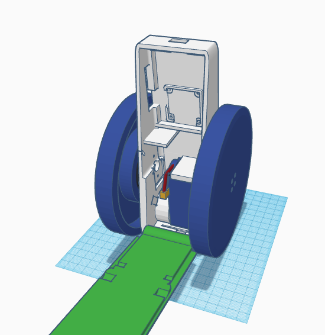

# **Betabot**

### The deep learning robot.

**Consists of:** 3D printable body, Raspberry Pi 3, motor controller board with an IMU, three gimbal motors, rotation sensors, battery, power management boards, and a tail.

**Software:** TensorFlow, ROS, Bullet physics simulator, Python, controller board C build system.  

**Includes:** Hardware parts list, build instructions, and downloadable pre-built software images.

*All open source.*

**Pre-built hardware:** Available for US$399.

Here is the 3D body model:

Here is the inside, with just the battery. You can see where the Pi goes, at the top, with the 3cm x 3cm controller board behind it.

And here is the physics simulator. The Betabots are having a conference:

## 3D body

Edit and print the 3D parts here.

[Editable 3D design](https://www.tinkercad.com/things/afFL2ZvOf82-betabot)

[STL file for 3D printing](3D/betabot.stl)

## Videos

Work in progress...

[Moving](https://www.instagram.com/p/BSNbtOvhLsf/?taken-by=tomjacobs83)

[Upright](https://twitter.com/TomPJacobs/status/848138218755170305)

[Inside](https://twitter.com/TomPJacobs/status/848136720797192192)

## How to build

Take the 3D printed case, two motors, and six screws. Make sure the small magnets are still affixed to back of motor axels. Place one motor on the side with cables running through the hole in the case. Rotate until screw holes line up, and screw three screws in half way.

Take one motor sensor (small green AMS board with one chip), and slide it into position under the three screws, with chip facing towards and sitting directly under the motor magnet. Screw three screws fully in to hold the motor and board in place. Repeat with the other motor.

Take the 3cm x 3cm controller board and place it into the mounting square in the case, with the microUSB port facing out towards the open side. Screw it down with four tiny screws.

Take the on switch and push it into position on the right.

Take the Raspberry Pi board and place it over the controller board, with USB ports facing towards the middle of the case and the HDMI port facing out towards the open side. Screw down with four small screws. 

Take the two speed controller boards and plug the motors into them, either way around, either speed controller. Place them down in the small middle area of the case, with red and black power leads facing right, away from the open side. Snake the cables up on the right side.

Place the power boards on top of the motor boards. 

Run the power cable into the battery compartment. Place the battery into the battery compartment and plug it in. 

Take the battery charger board and slide it in over the top of the battery facing upwards with the white ports facing towards the middle. Plug the battery's charge cable into the largest white port. Screw into place with one screw. Screw two round-headed screws through the bottom of the case into the charge bolts.

Take the top 3D printed cover and place it over the top of the body. Align the screw holes and screw the long screws in to affix the top. It should open freely to 120 degrees and close completely.

Switch Betabot on. Betabot should wake up after a minute and come to life.

